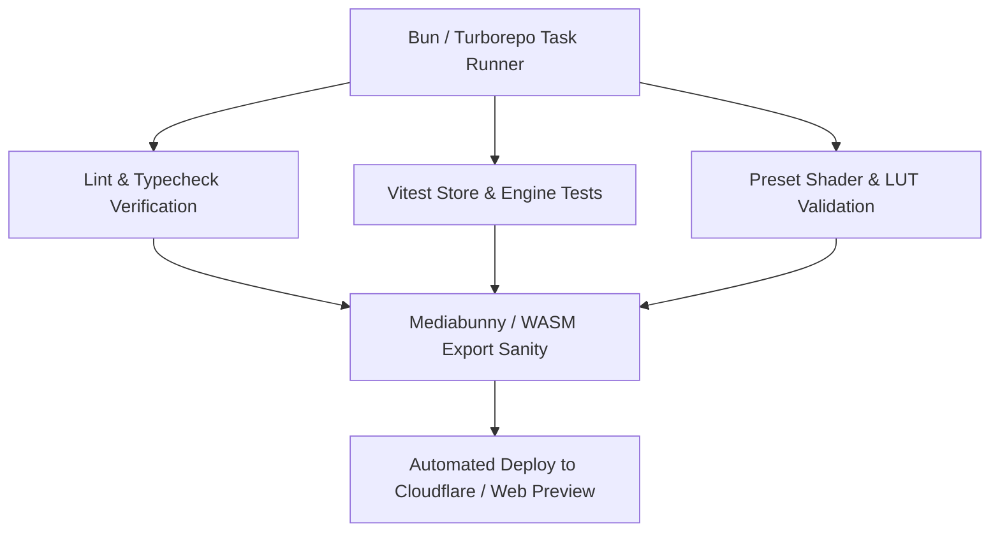

# OpenCut Future Updates, Architecture Roadmap & Automation Blueprint (2026+)

## 1. Executive Summary & Zero-Code Acceleration
OpenCut accelerates browser-based non-linear video editing (NLE) by combining modern Web standards (WebCodecs, WebGPU, WebGL shaders, Canvas, WebAssembly FFmpeg) with pre-built, battle-tested open-source modules.

---

## 2. Open-Source Ecosystem to Reduce Dev Time

| Component | Target Open-Source Software | How It Saves Dev Time | Key Capabilities & Zero-Code Replacement |
| :--- | :--- | :--- | :--- |
| **Animation Presets & Physics** | `motion` (Framer Motion) + `motion-canvas` + `lottie-web` / `@dotlottie/player-component` | Instant keyframe interpolations, spring physics, dynamic vector animation pipelines | 100+ entrance/exit animations (Pop, Whip, Elastic, Glitch, Cinematic Zoom) with zero custom math |
| **Video Engine & Shaders** | `gl-transitions` + `@remotion/player` + `regl` | Hundreds of WebGL transitions ready-to-use | Wipe, Burn, Morph, Dissolve, Pixelize, Light Leak, RGB Split |
| **Audio Processing & EQ** | `tone.js` + `meyda` + `soundtouchjs` | Zero audio math for pitch/time stretch & visualization | Pitch shift, real-time audio spectrum analyzer, 10-band graphic equalizer, auto-ducking |
| **Timeline Canvas / Scrubber** | `@dnd-kit/core` + `@dnd-kit/sortable` + `wavesurfer.js` | Full waveform rendering & drag-drop snapping tracks | Multi-track audio waveform peaks, magnetic snapping, ripple editing |
| **AI Intelligence / MCP** | `@modelcontextprotocol/sdk` + `onnxruntime-web` + `@xenova/transformers` (Whisper / SAM) | Client-side zero-cloud AI execution | Auto-subtitles, background removal (Segment Anything), silent-gap cutter, auto-beat detection |
| **Color Grading & LUTs** | `three` / `webgl-lut` / `gl-matrix` | Real-time 3D LUT (.cube) parsing and shader pipeline | Filmora/Teal & Orange/Cyberpunk cinematic color presets |

---

## 3. Future Backend & Scalable Engine Updates

> **Status**: local-first pipeline implemented (WebCodecs GPU render engine in store, undo/redo, template + transition + LUT + animation engine, FPS telemetry, **auto-edit engine, Dexie persistence, keyframe graph editor, MediaRecorder export, loop/snap transport**). Backend items below remain future work.

1. **Cloud Render Workers (Optional Hybrid Mode)** ⏳
   - Headless Chromium Remotion renderer on AWS Lambda / Cloudflare Workers / Fly.io for 4K 60FPS multi-threaded export.
   - Streaming multipart rendering combining GPU slices.
2. **Local WebCodecs Hardware Export (Mediabunny / WebCodecs)** 🔶 (MediaRecorder `captureStream` export shipped; true `VideoEncoder`/`AudioEncoder` zero-copy worker pending)
   - Direct zero-copy encoding to MP4 using `VideoEncoder` / `AudioEncoder` for 10x-50x faster rendering compared to standard WASM.
3. **Local SQLite / IndexedDB State Sync (Dexie.js / ElectricSQL / CRDTs)** 🔶 (✅ Dexie.js autosave + load/clear shipped; Yjs/Liveblocks real-time collaboration — ⏳)
   - Auto-save timeline history (Undo/Redo with infinite depth) — ✅ 50-deep in-memory undo/redo shipped.
   - Multi-user real-time collaboration via Yjs or Liveblocks — ⏳.
4. **AI MCP Agentic Backend (`packages/premiere-mcp`)** ⏳
   - 282+ tools for programmatic video scripting:
     - `cut_silence(thresholdDb: -30, minDurationMs: 500)`
     - `generate_subtitles(clipId, language: 'en', style: 'mrbeast')`
     - `smart_reframe(aspectRatio: '9:16', subjectTrack: true)`
     - `auto_color_match(sourceClipId, targetClipId)`
5. **Dedicated Offscreen Web Workers** ⏳ — move FFmpeg/WASM decode+encode off the main thread (Comlink).

---

## 4. Extended Controls & UI Integrations

1. **Keyframe Control Curves (Bezier Graph Editor)** ✅ — shipped: property selector (scale/position/opacity/rotation), easing curves, SVG graph with playhead scrubber, add/delete key at playhead, commit per-property tracks to clips.
2. **Preset Animation Library** ✅ — 115 animation presets, 45 templates, 48 effects, 31 transitions, 12 LUTs, 14 trends + dynamic template generator + one-click **AUTO EDIT ENGINE** (beat-sync / viral / clean / documentary).
3. **Audio Master Suite** ✅ — noise gate, vocal enhancer, background music auto-ducking, noise reduction, 5-band parametric EQ (Tone.js).
4. **CapCut / Canva Overlay Viewport** 🔶 — canvas layers, vector shapes, FX overlays, magnetic-snap toggle shipped; multi-select bounding boxes pending.

---

## 5. Potential Mistakes & Blunders to Avoid

| Blunder / Mistake | Impact | Prevention & Solution |
| :--- | :--- | :--- |
| **Heavy WASM Blocking Main Thread** | Freezes UI during decoding or export | Offload all FFmpeg and heavy processing to Dedicated Web Workers (`Worker` / `Comlink`). |
| **Unbounded Canvas Re-renders** | Frame drops during timeline playback | Memoize Konva shapes, use canvas offscreen buffers, sync transport clock via `requestAnimationFrame`. |
| **Audio/Video Sync Drift** | Audio loses sync after multiple cuts/splits | Compute absolute source timestamps (`presentationTimestamp`) rather than relative accumulators. |
| **Memory Leaks in WebCodecs Decoders** | Browser tab crashes on long 4K timelines | Explicitly close `VideoFrame` and `AudioData` instances (`frame.close()`) immediately after consumption. |
| **Unvalidated State Mutations** | Broken timeline undo/redo tree | Use immutable Zustand state slices with `immer` and validate clip payloads with `zod`. |

### Blunders Found & Fixed This Sprint

| Real Blunder | Where | Fix |
| :--- | :--- | :--- |
| `easeOutBounce` assigned to `const x` while mutating it | `src/lib/motion/easings.ts` | `let x` |
| `interpolate` did not clamp raw input to [0,1] | `src/lib/motion/engine.ts` | clamp raw before easing lookup |
| `sampleAnimation` sampled tracks at raw seconds instead of normalized progress | `src/lib/motion/engine.ts` | sample at `progress` |
| Test isolation: `generateDynamicTemplate` prepended to `availableTemplates`, polluting count assertions | `src/lib/store/editorStore.test.ts` | `resetEditorStore()` in `beforeEach` |
| Spring easing residue (1.000023) at t=1 failed strict equality | `engine.test.ts` | tolerance `toBeCloseTo(..., 4)` |
| Konva `<Ellipse>` used `width/height` instead of `radiusX/radiusY` | `OpenCutEditor.tsx` | `radiusX={w/2} radiusY={h/2}` |
| `previewTransform.progress` accessed on `TransformValues` (no such field) | `OpenCutEditor.tsx` | keep full `SampledAnimation`, read `.progress` from it |
| shadcn `calendar.tsx` used `table` class key not in react-day-picker v10 typings; `scroll-area.tsx` unused React import; `spinner.tsx` spread `string|number` strokeWidth | `components/ui/*` | remove invalid key / import / swallow strokeWidth |
| vitest config used `__dirname` (native config loader) | `vitest.config.ts` | `import.meta.dirname` |

---

## 6. Comprehensive Testing Strategy

- **Unit Testing**: Vitest for Zustand store actions (`splitClip`, `rippleDelete`, `addKeyframe`, `seek`).
- **Integration Testing**: Testing Library for UI components, transport bar, inspector panel, and shortcut bindings.
- **E2E Visual Regression**: Playwright for canvas rendering, timeline drag & drop, and WebCodecs export sanity.

---

## 7. Parallel Chain-Reaction Automation Scripts

Chain-reaction pipelines automate repetitive development, testing, preset validation, and CI checks:

### Shipped Automation (August 2026)

- [`tools/chain-reaction.mjs`](file:///d:/CODES/openCUT/tools/chain-reaction.mjs) — one-shot `typecheck (tsc) → vitest run → vite build` with color-coded per-stage results and proper exit codes. Flags: `--skip-typecheck`, `--skip-tests`, `--skip-build`.
- [`tools/chain-reaction.ps1`](file:///d:/CODES/openCUT/tools/chain-reaction.ps1) — PowerShell wrapper mirroring the flags.
- [`Launch-OpenCut.bat`](file:///d:/CODES/openCUT/Launch-OpenCut.bat) / [`Launch-OpenCut.ps1`](file:///d:/CODES/openCUT/Launch-OpenCut.ps1) — quick-launch that runs the chain reaction before booting the dev server on :5173.
- **Next**: wire the chain reaction into a GitHub Action (`CI: typecheck + tests + build on push/PR`).
