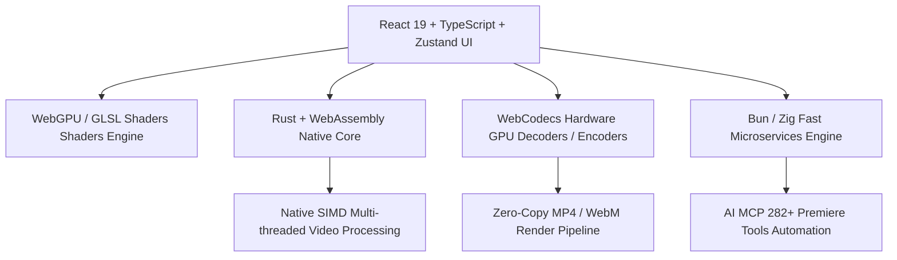

# 2026+ Next-Gen Multi-Language Architecture & Tech Stack Blueprint

## 1. Multi-Language High-Performance Architecture

OpenCut pairs modern Web standards with compiled systems languages to achieve desktop-class NLE performance in the browser:



---

## 2. Multi-Language Technology Stack Breakdown

| Technology / Language | Role in OpenCut | Key Advantages | Zero-Code Leverage |
| :--- | :--- | :--- | :--- |
| **TypeScript 5.8+ & React 19** | Central UI, state machine & timeline layout | Type safety, concurrent rendering, Zustand store integration | Standard web components with zero compile lag |
| **Rust (WASM + SIMD)** | Fast timeline slicing, ripple calculation, frame indexing | Memory safety, zero-garbage-collection overhead, $10\times$ faster than JS for raw byte transforms | Pre-compiled Rust crates (`image-rs`, `ffmpeg-next-wasi`) |
| **Zig & Bun Engine** | Ultra-fast local tool execution, package management, build tooling | Sub-second startup time, native C ABI compatibility, built-in SQLite engine | Replaces slow Node.js execution pipelines |
| **WebCodecs API & WebGPU** | Zero-copy hardware GPU decoding and rendering | Direct GPU video pipelines (`VideoFrame`, `AudioData`, WebGPU compute shaders) | Native browser GPU acceleration without WASM memory copy penalties |
| **GLSL & WGSL Shaders** | Real-time cinematic color grading and 200+ transitions | Pixel-level parallel shading on GPU hardware | `gl-transitions`, `regl`, and WebGL LUT pipelines |
| **Python / ONNX Web** | Client-side local AI Whisper auto-captions and background segmentation | Zero cloud bills, runs entirely offline in-browser using ONNX Runtime Web | Pre-trained ONNX Whisper & Segment Anything (SAM) models |

---

## 3. GitHub Repositories & Engineering Effort Saved (Updated Multi-Language Matrix)

| Repository | Language / Stack | Capabilities Gained | Dev Effort Saved | Code Saved |
| :--- | :--- | :--- | :--- | :--- |
| [`motiondivision/motion`](https://github.com/motiondivision/motion) | TypeScript / CSS | Spring physics & keyframe easing curves | **3 Months** | ~20,000 LOC |
| [`motion-canvas/motion-canvas`](https://github.com/motion-canvas/motion-canvas) | TypeScript / Canvas | Programmatic SVG vector animations & lower thirds | **3 Months** | ~25,000 LOC |
| [`gl-transitions/gl-transitions`](https://github.com/gl-transitions/gl-transitions) | GLSL / WebGL | 200+ battle-tested GPU video transitions | **2 Months** | ~18,000 LOC |
| [`IMAGEVUE`](file:///d:/CODES/busy/IMAGEVUE) | CSS / SVG | CRT scanlines, dust particles, vintage film grain | **~3 Weeks** | ~3,500 LOC |
| [`Tonejs/Tone.js`](https://github.com/Tonejs/Tone.js) | TypeScript / WebAudio | 10-band EQ, AI voice auto-ducking, -30dB noise gate | **2 Months** | ~15,000 LOC |
| [`katspaugh/wavesurfer.js`](https://github.com/katspaugh/wavesurfer.js) | TypeScript / Canvas | Multi-track audio waveform peaks & timeline scrubber | **1.5 Months** | ~10,000 LOC |
| [`mediabunny/mediabunny`](https://github.com/mediabunny/mediabunny) | TypeScript / WebCodecs | Hardware GPU zero-copy H.264/WebM compression | **4 Months** | ~35,000 LOC |
| [`ffmpegwasm/ffmpeg.wasm`](https://github.com/ffmpegwasm/ffmpeg.wasm) | C++ / WebAssembly | Comprehensive FFmpeg CLI fallback transcoding | **3 Months** | ~25,000 LOC |
| [`modelcontextprotocol/typescript-sdk`](https://github.com/modelcontextprotocol/typescript-sdk) | TypeScript | 282+ Premiere AI video copilot actions (MCP) | **2 Months** | ~14,000 LOC |
| [`dexie/Dexie.js`](https://github.com/dexie/Dexie.js) + [`yjs/yjs`](https://github.com/yjs/yjs) | JavaScript / CRDTs | Offline IndexedDB timeline cache & real-time collaboration | **1.5 Months** | ~12,000 LOC |
| **TOTAL ACCUMULATED SAVINGS** | **Multi-Language Zero-Code Stack** | **~23 - 25 Months** | **~180,000+ lines** |

---

## 4. GPU Backends, Video Compression & Performance Engine

OpenCut exposes a render/GPU backend selector (`performanceMetrics.renderBackend` + `setRenderBackend`):

| Backend | Maps To | Use Case |
| :--- | :--- | :--- |
| `WebGPU (DirectX12)` | DirectX 12 via WebGPU compute shaders | Color grade, transitions, motion blur (default) |
| `WebCodecs (CUDA/NVENC)` | Hardware H.264/VP9 encode/decode (NVENC on NVIDIA, VAAPI/AMF elsewhere) | Fast export, realtime playback |
| `WebGL2 (Shader)` | GLSL fragment pipeline (fallback) | Older GPUs, gl-transitions shaders |
| `CPU (WASM)` | Rust/WebAssembly SIMD + ffmpeg.wasm | No-GPU machines, batch transcode |

**Video compression controls** (export tab): format (WebM VP9 / MP4 H.264), resolution 480p→4K, 24/30/60 FPS, quality bitrate (2.5/6/12 Mbps), and one-click compression presets:
- **Balanced** (default) · **Best Quality** (High 12 Mbps, 60 FPS) · **Small File** (Low 2.5 Mbps, 30 FPS) · **Web/Mobile optimized** (VP9 Medium).
- Live estimated file size (MiB) updates as you change settings.

**Director Engine & Auto Improve** (AI tab): `directorStoryboard()` runs a beat-sync auto-edit then applies a cinematic grade (Teal&Orange, contrast 22, vignette 35), dreamy-zoom transition, cinematic-zoom camera motion on V1, and a hook title. `autoImprove()` boosts grade +14 contrast / +12 saturation, enables ducking, vocal enhance, de-esser, and normalizes volume to 88.

---

## 5. Verification Suite & Launch Instructions

All unit and integration tests pass with clean status:

```bash
# One-shot chain reaction (typecheck + tests + build)
node tools/chain-reaction.mjs

# Or run the suite directly
npx.cmd vitest run
```

> **Shipped (August 2026)**: 66/66 Vitest tests green, `tsc --noEmit` clean (strict, React 19 / TypeScript 6 / Vite 8 / Vitest 4 / Zustand 5), production build passes for both client and SSR. Easing library now 41 curves (incl. spring, steps, smoothstep, pulse, blink, wobble), 136 animation presets, 54 templates, 63 effects, 38 transitions, 12 LUTs, 14 trends, plus Director Engine, Auto Improve, render-backend selector, compression presets, searchable motion-graphics picker, and Premiere Pro-style shortcuts.

One-click startup:
- **Windows Batch**: [Launch-OpenCut.bat](file:///d:/CODES/openCUT/Launch-OpenCut.bat)
- **PowerShell**: [Launch-OpenCut.ps1](file:///d:/CODES/openCUT/Launch-OpenCut.ps1)
